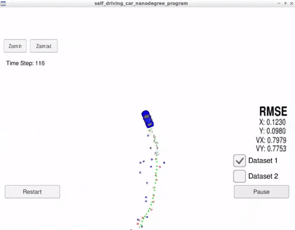

# Udacity Self-Driving Car Engineer Nanodegree (SDCe-ND)

In this repository I'll track my completed projects for the Udacity [Self-driving Car Engineer Nanodegree](https://www.udacity.com/course/self-driving-car-engineer-nanodegree--nd013).

## Projects

### Lane Line Detection
Determine region of interest using a polygon, grayscaling and blurring, determine edges using Canny Edge Detection and transform these into Hough space to find the lane lanes in a video.

### Advanced Lane Line Detection
Determine region of interest using a polygon, grayscaling and blurring, determine edges using Canny Edge Detection and transform these into Hough space to find the lane lanes in a video.

### Traffic Sign Classifier
Classify signs from a large set of German traffic sign images using a Convolutional Neural Net (CNN).
Model structure: 

| Layer         		|     Description	        					| 
|:---------------------:|:---------------------------------------------:| 
| Input         		| 32x32x3 RGB image   							| 
| Convolution 5x5     	| 1x1 stride, valid padding, outputs 28x28x6 	|
| RELU					|												|
| Max pooling	      	| 2x2 stride,  outputs 14x14x6 				|
| Convolution 5x5	    | 1x1 stride, valid padding, outputs 10x10x16 	|
| RELU					|												|
| Max pooling	      	| 2x2 stride,  outputs 5x5x16 				|
| Fully connected		| input 400, output 120, flat				|
| RELU					|												|
| Dropout					| Keep 60%												|
| Fully connected		| input 120, output 84, flat				|
| RELU					|												|
| Dropout					| Keep 60%												|
| Fully connected		| input 84, output 43, flat				|
| Softmax				| on logits        									| 

### Behavioral Cloning
Using the provided driving simulator, test data was generated by driving a car around the track. Using the recorded images, steering angles and throttle, the Neural Network was trained to drive the car within the simulator itself:

### Localization: Extended Kalman Filter (C++)
Using the Extended Kalman Filter equations, an algorithm was developed to predict the car's position (green triangles) and update accordingly with both LIDAR (red dots) and RADAR (blue dots) measurements:

### Localization: Particle Filter (C++)
This project is a 2 dimensional particle filter in C++, determining the cars location based on sensor measurements of nearby landmarks.

### Path planning (C++)
Using the observed position of other cars within the simulator (LiDAR dots through sensor fusion to coordinates), this algorithm navigates the car within the simulator, changing lanes when necessary and slowing down when other cars occupy the adjecent lines within the safety margin.
